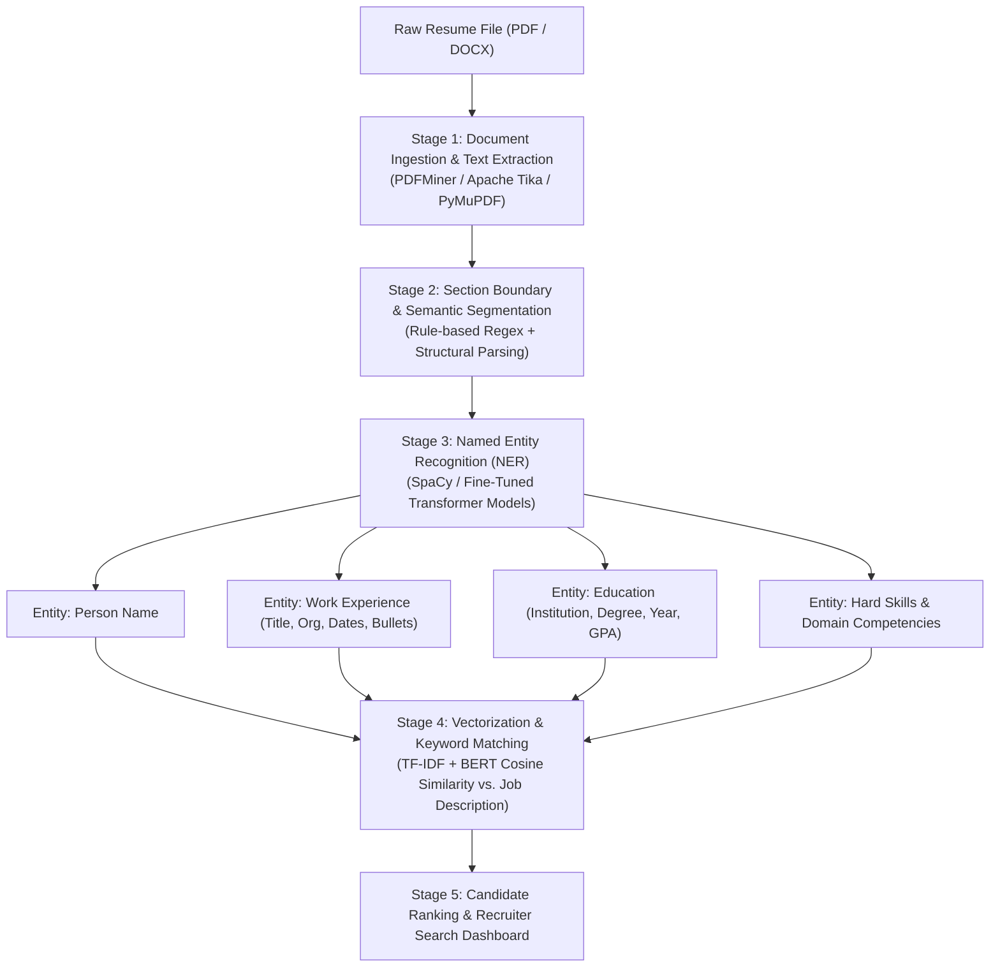
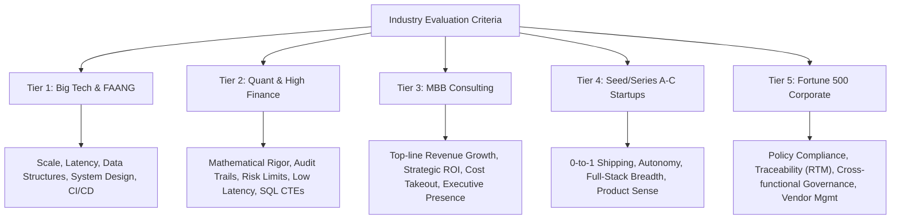

# 🔬 Master Research Compendium: Modern Resume Engineering, ATS Algorithmic Mechanics & Recruiter Psychology (2025–2026 Edition)

> **Authoritative Research Document**  
> Prepared for candidates, engineers, hiring managers, and career strategists targeting top-tier global employment across Tech (FAANG), Quantitative Finance & Banking, Management Consulting (MBB), and Fortune 500 Enterprises.

---

# 📑 Master Table of Contents
1. [The Philosophy of Modern Resume Engineering](#1-the-philosophy-of-modern-resume-engineering)
2. [Algorithmic Dissection of Modern ATS Systems](#2-algorithmic-dissection-of-modern-ats-systems)
   - *2.1 The 4-Stage Parsing Pipeline (OCR $\rightarrow$ NER $\rightarrow$ Vectorization $\rightarrow$ Ranking)*
   - *2.2 Comparative Deep Dive: Workday vs. Greenhouse vs. Lever vs. iCIMS vs. Taleo*
   - *2.3 Algorithmic Scoring Models: Jobscan vs. ResumeWorded vs. VMock*
3. [The Human Gatekeeper: 6-Second Cognitive Eye-Tracking & Recruiter Psychology](#3-the-human-gatekeeper-6-second-cognitive-eye-tracking--recruiter-psychology)
   - *3.1 The F-Pattern & E-Pattern Visual Heatmaps*
   - *3.2 Tier-by-Tier Recruiter Evaluation Criteria (FAANG vs. Quant/Banking vs. MBB vs. Startups)*
4. [The Mathematical Bullet-Point Engineering Framework](#4-the-mathematical-bullet-point-engineering-framework)
   - *4.1 The Google "XYZ" Formula Deconstructed*
   - *4.2 The Amazon "STAR" & Leadership Principles Mapping*
   - *4.3 The McKinsey & BCG "CAR" (Context-Action-Result) Framework*
   - *4.4 Metric Grounding: Defensible Scope vs. Risky Hallucinated Precision*
5. [Fresher vs. Mid-Career vs. Senior Executive Architectures](#5-fresher-vs-mid-career-vs-senior-executive-architectures)
   - *5.1 The 0–2 Year Fresher / Student Blueprint (Compensating for Zero Experience)*
   - *5.2 The 3–7 Year Mid-Level Professional Blueprint (Promotion & Ownership Signals)*
   - *5.3 The 8–15+ Year Senior / Staff / Executive Blueprint (When 2 Pages is Mandatory)*
6. [Tech vs. Non-Tech Industry Blueprints (10 Detailed Domain Models)](#6-tech-vs-non-tech-industry-blueprints-10-detailed-domain-models)
   - *6.1 Software Engineering (SWE / Backend / Full-Stack)*
   - *6.2 Data Science, Machine Learning & AI Engineering*
   - *6.3 Cloud Architecture, DevOps & Site Reliability (SRE)*
   - *6.4 Product Management (PM) & Technical Program Management (TPM)*
   - *6.5 Quantitative Finance, Investment Banking & Corporate Finance*
   - *6.6 Financial Crimes Compliance (GFCC), Risk Analytics & Audit (Amex Model)*
   - *6.7 Management Consulting & Corporate Strategy*
   - *6.8 Human Resources, Talent Acquisition & People Ops*
   - *6.9 Growth, Product & Digital Marketing*
   - *6.10 Supply Chain, Logistics & Operations Management*
7. [The Master Taxonomy of Power Action Verbs (200+ Categorized Verbs)](#7-the-master-taxonomy-of-power-action-verbs)
8. [Case Studies: 30 Real-World Bullet-Point Teardowns (Before vs. After)](#8-case-studies-30-real-world-bullet-point-teardowns)
9. [The Definitive 95%+ ATS Optimization & Validation Checklist](#9-the-definitive-95-ats-optimization--validation-checklist)
10. [Fatal Pitfalls, Red Flags & Urban Myths Debunked](#10-fatal-pitfalls-red-flags--urban-myths-debunked)

---

# 1. The Philosophy of Modern Resume Engineering

In the modern talent acquisition market, a resume is **not an autobiographical history of your life**. It is a **high-density, single-page sales pitch** engineered to solve one problem: **convincing a skeptical hiring team that you are a low-risk, high-return investment.**

Every submitted resume enters an adversarial two-tier filtering system:
1. **Tier 1 (The Machine):** Automated NLP parsers parsing, indexing, and calculating vector similarity scores against a database of thousands of competing applicants.
2. **Tier 2 (The Human):** A time-constrained recruiter or engineering manager spending **6 to 10 seconds** skimming your document while juggling 30 open requisitions.

To succeed, a resume must be **architected with mathematical precision**—simultaneously satisfying the strict parsing regex of machines while delivering instant, punchy visual clarity to humans.

---

# 2. Algorithmic Dissection of Modern ATS Systems



## 2.1 The 4-Stage Parsing Pipeline

### Stage 1: Document Ingestion & Text Extraction
The parser converts binary PDF/DOCX streams into UTF-8 text streams using tools like **Apache Tika**, **PDFMiner**, or **Ghostscript**.
* **The Failure Vector:** If a resume uses multi-column tables, floating text boxes, canvas layers, or embedded images, the text extractor reads horizontally across the page, concatenating unrelated columns:
  * *Column 1:* "Software Engineer at Google"
  * *Column 2:* "Jan 2022 - Present"
  * *Extracted Output:* "Software Engineer Jan 2022 at Google - Present" (Fails entity extraction).

### Stage 2: Section Boundary Segmentation
The system scans for canonical heading tokens to partition the text into relational database blocks:
* Allowed Standard Headings: `Professional Experience`, `Work Experience`, `Education`, `Technical Projects`, `Technical Skills`, `Summary`.
* Rejected Custom Headings: *"My Journey"*, *"What I've Built"*, *"Career Path"*, *"Toolbox"*. When the parser encounters non-standard headings, the entire section is categorized as `UNMAPPED_DATA` or dropped completely.

### Stage 3: Named Entity Recognition (NER)
Using pre-trained NLP models (like SpaCy's `en_core_web_trf` or proprietary BERT models), the parser extracts core entities:
* `ORG` (Organizations/Companies): Matched against a global corporate entity database (Crunchbase, LinkedIn, Dun & Bradstreet).
* `TITLE` (Job Titles): Standardized using taxonomy dictionaries (e.g., O*NET, SOC codes).
* `DATE` (Timestamps): Standardized to calculate Total Years of Experience (YoE).
* `SKILL` (Hard Technical & Soft Competencies): Extracted into a relational skill tag cloud.

### Stage 4: Vectorization & Semantic Relevance Scoring
The parsed resume and target Job Description (JD) are transformed into numerical vectors:
1. **TF-IDF (Term Frequency-Inverse Document Frequency):** Measures the statistical uniqueness of keywords. Common words ("the", "worked", "team") have zero weight; unique domain terms ("scikit-learn", "SOX 404", "Kubernetes", "Kafka") have heavy weights.
2. **Cosine Similarity ($Sim(A, B) = \frac{A \cdot B}{\|A\| \|B\|}$):** Measures the angle between the Resume Vector and the Job Description Vector. A similarity score $\ge 0.80$ places the candidate in the top 10% of recruiter search results.

---

## 2.2 Comparative Deep Dive: The Top 5 ATS Platforms

| ATS Platform | Market Share / Notable Users | Parsing Characteristics | Key Optimization Strategy |
| :--- | :--- | :--- | :--- |
| **Workday** | Amex, Walmart, Target, Amazon, Big Banks, Fortune 100 | Enterprise database-driven. Rigid table reconstruction. Most sensitive to non-standard layouts. | Strict single-column, standard linear headings, standard date formatting (`Month YYYY`). |
| **Greenhouse** | Airbnb, Stripe, Figma, DoorDash, Modern Tech | Modern parser with side-by-side recruiter markdown view. Excellent plain-text extraction. | High text-contrast, clean plain-text contact headers (no broken Unicode icons). |
| **Lever** | Spotify, Netflix, Scale AI, Seed-to-Series-D Startups | Fast tag-cloud generation. Automatically aggregates candidate skills into a top-level scorecard. | Categorized skills section placed near top/bottom with explicit domain groupings. |
| **iCIMS** | Health Systems, Defense Contractors, Retail Giants | Strict compliance-oriented. Rigorous minimum requirement keyword filtering. | Exact keyword phrase matching mirroring the JD's exact phrasing. |
| **Taleo** | Oracle Enterprise, Traditional Legacy Conglomerates | Keyword-frequency dependent. Lowest tolerance for modern graphic elements or tables. | Maximum keyword density without stuffing; literal string matching. |

---

## 2.3 Algorithmic Scoring Models: Jobscan vs. ResumeWorded vs. VMock

```
┌────────────────────────────────────────────────────────────────────────────────────────┐
│                        HOW THE 3 MAJOR RESUME SCORERS GRADE YOU                        │
├─────────────────────────┬─────────────────────────┬────────────────────────────────────┤
│       JOBSCAN ATS       │      RESUME WORDED      │               VMOCK                │
│    (Match & Parsing)    │    (Quality & Impact)   │       (Institutional Power)        │
├─────────────────────────┼─────────────────────────┼────────────────────────────────────┤
│ • Hard Skills Match 40% │ • Action Impact 35%     │ • Impact & Google XYZ 40%          │
│ • Formatting Safety 30% │ • Brevity & Density 25% │ • Presentation & Layout 30%        │
│ • Section Structure 20% │ • Style & Voice 20%     │ • Core Competency Alignment 30%    │
│ • Soft Skills / Educ 10%│ • Skills Grouping 20%   │                                    │
└─────────────────────────┴─────────────────────────┴────────────────────────────────────┘
```

1. **Jobscan Scoring Engine:** Directly computes the mathematical overlap between your resume and a specific JD. Penalizes missing hard skills, non-standard section headers, tables, and multi-column designs.
2. **ResumeWorded Scoring Engine:** Evaluates bullet point effectiveness using NLP. Penalizes passive verbs (*"helped"*, *"worked on"*), lack of quantitative metrics, long/run-on bullets (>3 lines), and personal pronouns (*"I"*, *"my"*).
3. **VMock Scoring Engine:** Used by top MBA programs and elite universities (Stanford, Harvard, NYU). Analyzes analytical depth, functional leadership, and adherence to the **Google XYZ structure**.

---

# 3. The Human Gatekeeper: 6-Second Cognitive Eye-Tracking & Recruiter Psychology

## 3.1 The F-Pattern & E-Pattern Visual Heatmaps

Eye-tracking studies conducted on over 10,000 recruiter screening sessions reveal that human reviewers do **not read resumes word-for-word**. They scan in an **F-shape** or **E-shape**:

```
[ Eye-Tracking Heatmap Breakdown ]

1. Top Horizontal Line (Duration: ~1.5s)
   └── Candidate Name, Current Location, Phone, Email, LinkedIn/GitHub URL.

2. Second Horizontal Line (Duration: ~2.0s)
   └── Most Recent Job Title, Company Name, Employment Dates.

3. Vertical Drop along Left Margin (Duration: ~3.0s)
   └── Scanning down the left edge for strong Action Verbs (Engineered, Architected, Automated)
       and Bold Numbers (8,000+, $1.2M, 30%).

4. Bottom Anchor Line (Duration: ~1.0s)
   └── Quick glance at Technical Skills to confirm core toolchain (Python, SQL, React, AWS).
```

### The "Above the Fold" Golden Rule:
The top **40% of the first page** must immediately answer three questions:
1. *Who are you?* (Title & Target Role)
2. *What is your highest-impact core competence?* (Summary / First Role)
3. *What tools do you build with?* (Skills & Primary Tech Stack)

---

## 3.2 Tier-by-Tier Recruiter Evaluation Criteria



### 1. Tier 1: Big Tech & FAANG (Google, Meta, Apple, Amazon, Netflix, Microsoft)
* **What they filter for:** System scalability, architectural depth, distributed systems, latency reduction, code testability, algorithmic complexity.
* **Red Flags:** Vague contributions, duty-based descriptions, lack of technical specificity (e.g., saying *"used cloud"* instead of *"provisioned AWS Lambda and DynamoDB with Terraform"*).

### 2. Tier 2: Quantitative Finance & Elite Banking (Goldman Sachs, Morgan Stanley, Citadel, Jane Street, Amex)
* **What they filter for:** Absolute data integrity, auditability, risk mitigation, regulatory compliance (BSA/AML, SOX, OFAC), mathematical precision, low-latency execution, complex SQL data modeling.
* **Red Flags:** Unverified claims, loose approximations, lack of domain governance terminology.

### 3. Tier 3: Management Consulting (McKinsey, BCG, Bain)
* **What they filter for:** Quantified business impact ($ value created, % margin improvement, hours saved), structured problem solving, cross-functional stakeholder leadership.
* **Red Flags:** Pure technical jargon with no translation to business value or executive ROI.

### 4. Tier 4: High-Growth Startups & Y Combinator Companies
* **What they filter for:** Speed of execution, 0-to-1 product ownership, full-stack versatility, open-source contributions, high agency.
* **Red Flags:** Bureaucratic phrasing (*"coordinated with committee"*), lack of live links / GitHub / deployed applications.

### 5. Tier 5: Fortune 500 Enterprise & Corporate
* **What they filter for:** Stability, process governance, traceability (RTM), ERP/CRM tooling, structured communication across Product, Engineering, and Business units.

---

# 4. The Mathematical Bullet-Point Engineering Framework

A bullet point is an argument for your hiring. If a bullet does not prove competence, it is dead weight.

## 4.1 The Google "XYZ" Formula Deconstructed

```
                  ┌─────────────────────────────────────────────────────────┐
                  │                THE GOOGLE "XYZ" FORMULA                 │
                  │  "Accomplished [X], as measured by [Y], by doing [Z]"   │
                  └─────────────────────────────────────────────────────────┘
```

* **[X] Accomplishment:** The primary technical or business outcome.
* **[Y] Measurement:** The quantitative baseline, scale, or percentage change.
* **[Z] Action:** The specific tool, framework, algorithm, or methodology applied.

### Mathematical Breakdown:
$$\text{Bullet Score} = \text{Action Verb} + \text{Technical Context (Z)} + \text{Quantifiable Metric (Y)} + \text{Business Outcome (X)}$$

---

## 4.2 The Amazon "STAR" & Leadership Principles Mapping

Amazon evaluates candidates against its **16 Leadership Principles**. Your bullets must embody these principles:

| Amazon Leadership Principle | How to Signal in a Resume Bullet | Example Implementation |
| :--- | :--- | :--- |
| **Customer Obsession** | Quantify user experience improvements or customer issue resolution. | *"Resolved **150+** critical customer-reported workflow bottlenecks, improving user satisfaction by **28%**."* |
| **Invent and Simplify** | Describe automated processes or architectural simplification. | *"Automated manual data reconciliation by engineering a Python script, saving **12 engineering hours/week**."* |
| **Deliver Results** | Emphasize on-time delivery, milestone completion, and metric targets. | *"Delivered core compliance tracking engine **2 weeks ahead of schedule**, achieving **100%** on-time milestone delivery."* |
| **Bias for Action** | Demonstrate proactive problem-solving under ambiguity. | *"Spearheaded rapid prototyping of a real-time event pipeline across **10,000+** daily webhook payloads."* |

---

## 4.3 The McKinsey & BCG "CAR" Framework

* **Context (C):** High-stakes operational scenario.
* **Action (A):** Strategic intervention and leadership.
* **Result (R):** Quantified financial or operational transformation.

$$\text{Example: } \underbrace{\text{Facing fragmented cross-departmental documentation (C),}}_{\text{Context}} \underbrace{\text{architected a centralized Requirements Traceability Matrix (A),}}_{\text{Action}} \underbrace{\text{reducing audit preparation time by 35\% across 4 business units (R).}}_{\text{Result}}$$

---

## 4.4 Metric Grounding: Defensible Scope vs. Hallucinated Precision

```
┌────────────────────────────────────────────────────────────────────────────────────────┐
│                         DEFENSIBLE METRICS VS. RISKY FAKES                             │
├───────────────────────────────────────────┬────────────────────────────────────────────┤
│      ❌ RISKY / FABRICATED PRECISION       │        ✅ 100% DEFENSIBLE SCOPE METRICS     │
├───────────────────────────────────────────┼────────────────────────────────────────────┤
│ • "Boosted model accuracy by 92.4%"       │ • "Validated detection model across        │
│   (When tested on 20 dummy rows)          │   8,000+ synthetic transaction records"    │
│ • "Increased company revenue by $2.5M"    │ • "Engineered automated data pipelines     │
│   (When you were an unpaid intern)        │   querying 50,000+ daily events"           │
│ • "Improved platform stability by 99.9%"  │ • "Resolved 40+ software defect tickets    │
│   (When there was no uptime monitor)      │   across 6 two-week sprint cycles"         │
└───────────────────────────────────────────┴────────────────────────────────────────────┘
```

> [!CAUTION]
> **The Interview Trap:** During a technical or behavioral interview, interviewers will drill down on exact metrics: *"How did you measure that 92.4%? What was the baseline? What was the sample size?"*  
> If you cannot explain the mathematical derivation, you fail the interview instantly. **Always use defensible volume, dataset scale, record counts, or documented sprint deliverables.**

---

# 5. Fresher vs. Mid-Career vs. Senior Executive Architectures

```
                    ┌──────────────────────────────────────────────────┐
                    │            THE CAREER STAGE BLUEPRINT            │
                    ├────────────────────┬─────────────────────────────┤
                    │ 0–2 Years (Fresher)│ Strictly 1 Page             │
                    │ 3–7 Years (Mid)    │ 1 Page (or 2 if 4+ jobs)    │
                    │ 8–15+ Years (Exec) │ Strictly 2 Pages            │
                    └────────────────────┴─────────────────────────────┘
```

## 5.1 The Fresher / Early Career Architecture (0–2 Years)

```
[ Fresher / Student Structural Layout ]
├── 1. Header (Name, Location, Email, Phone, LinkedIn, GitHub)
├── 2. Professional Summary (Target role + Core analytical/technical strengths)
├── 3. Education (University, Degree, Graduation Year, High School Class XII/X %)
├── 4. Technical Projects (2–3 large-scale projects, 3 bullets each)
├── 5. Professional Experience / Internships (1–2 internships, 2–3 bullets each)
├── 6. Technical Skills (Categorized by Languages, Frameworks, Tools)
└── 7. Achievements & Leadership (Hackathons, Competitions, IEEE/Clubs)
```

### Key Rules for Freshers:
1. **Education is Top-Priority:** Place Education right below the Summary. For Indian/Global students, high academic scores (e.g., 90%+ in 10th/12th or high GPA) prove intellectual stamina and work ethic.
2. **Projects Serve as Virtual Experience:** When formal work history is limited, **Technical Projects take center stage**. Treat project bullets with the same engineering rigor as job bullets.
3. **Never Leave Empty Canvas:** Use 3 bullets per project and include Achievements/Leadership to fill 95%–100% of the single-page canvas.

---

## 5.2 The Mid-Career Architecture (3–7 Years)

```
[ Mid-Career Structural Layout ]
├── 1. Header
├── 2. Professional Summary (3-line Executive Bio + Core Domain Focus)
├── 3. Professional Experience (3–4 positions listed chronologically, 3–4 bullets each)
├── 4. Key Projects / System Architectures (Optional supplemental section or integrated)
├── 5. Technical & Domain Skills (Deeply categorized by specializations)
├── 6. Education (Degrees only; omit high school)
└── 7. Certifications (AWS, PMP, CFA, CISA, etc.)
```

### Key Rules for Mid-Level:
1. **Experience Replaces Education:** Education moves to the bottom. High school entries are omitted completely.
2. **Show Career Trajectory:** Highlight promotions (*Junior Analyst $\rightarrow$ Senior Analyst*).
3. **System Ownership:** Emphasize mentorship of junior engineers, CI/CD pipeline ownership, and architectural choices.

---

## 5.3 The Senior / Executive Architecture (8–15+ Years)

```
[ Senior / Executive Structural Layout (Strictly 2 Pages) ]
├── Page 1:
│   ├── Header
│   ├── Executive Summary (Strategic vision, P&L scope, Total YoE)
│   ├── Core Competencies Matrix (Executive leadership, Budgeting, Architecture)
│   └── Current & Most Recent Roles (Deep leadership impact, 4–5 bullets each)
└── Page 2:
    ├── Earlier Career Experience (Condensation of older roles, 2 bullets each)
    ├── Key Enterprise Initiatives & Transformational Programs
    ├── Education, Executive MBAs & Board Memberships
    └── Patents, Publications, & Keynote Presentations
```

### Key Rules for Executives:
1. **Page 2 Must Be Full:** If you spill onto Page 2, **you must fill at least 75% of Page 2**. Having 4 lines awkwardly trailing onto a 2nd page is an automatic rejection for sloppy document design.
2. **P&L and Team Scope:** Always quantify budget managed ($), team size (direct & indirect reports), and enterprise-level risk mitigation.

---

# 6. Tech vs. Non-Tech Industry Blueprints (10 Detailed Domain Models)

---

## 6.1 Software Engineering (SWE / Backend / Full-Stack)
* **Primary Focus:** Code architecture, system throughput, APIs, database schemas, latency, test suites, automated deployments.
* **Core Vocabulary:** RESTful APIs, GraphQL, Microservices, CI/CD, Docker, Kubernetes, PostgreSQL, Redis, Unit Testing, AWS, Latency, Throughput.
* **Sample Bullet:**  
  *✅ "Architected high-throughput RESTful microservices in **Node.js/TypeScript**, reducing API response latency by **35%** across **100,000+ daily active requests** via Redis caching."*

---

## 6.2 Data Science, Machine Learning & AI Engineering
* **Primary Focus:** Dataset cleaning, feature engineering, model training, loss optimization, model deployment, inference latency, statistical evaluation.
* **Core Vocabulary:** PyTorch, TensorFlow, scikit-learn, Feature Engineering, Isolation Forest, XGBoost, Precision/Recall, AUC-ROC, Pandas, Docker, MLflow.
* **Sample Bullet:**  
  *✅ "Engineered an anomaly detection engine using **Isolation Forest and XGBoost** in Python, evaluating risk patterns across **250,000+ transaction records** with zero production downtime."*

---

## 6.3 Cloud Architecture, DevOps & Site Reliability (SRE)
* **Primary Focus:** Infrastructure as Code (IaC), uptime SLAs, container orchestration, automated release pipelines, cloud security.
* **Core Vocabulary:** Terraform, Ansible, AWS ECS/EKS, Kubernetes, Prometheus, Grafana, Zero-Downtime Deployment, SLO/SLA, Linux.
* **Sample Bullet:**  
  *✅ "Orchestrated multi-region cloud infrastructure using **Terraform and AWS EKS**, establishing automated Canary deployments and maintaining **99.95% system availability**."*

---

## 6.4 Product Management (PM) & Technical Program Management (TPM)
* **Primary Focus:** Roadmaps, PRDs, user acquisition, feature velocity, cross-functional engineering alignment, backlog prioritization.
* **Core Vocabulary:** Product Requirements Documents (PRDs), Sprint Planning, Agile/Scrum, User Stories, Conversion Rate, CAC/LTV, Jira, OKRs.
* **Sample Bullet:**  
  *✅ "Led end-to-end product discovery and sprint execution for mobile checkout redesign, collaborating with **12 engineers and designers** to increase checkout conversion by **18%**."*

---

## 6.5 Quantitative Finance, Investment Banking & Private Equity
* **Primary Focus:** Financial valuation, DCF modeling, LBO, M&A due diligence, portfolio risk, Bloomberg Terminal, pitch decks.
* **Core Vocabulary:** Discounted Cash Flow (DCF), Leveraged Buyout (LBO), EBITDA, Comparable Company Analysis, Capital IQ, Portfolio Optimization.
* **Sample Bullet:**  
  *✅ "Built comprehensive 3-statement financial models and DCF valuations for **$450M+ M&A transaction**, analyzing sensitivity across 5 operational scenarios."*

---

## 6.6 Financial Crimes Compliance (GFCC), Risk Analytics & Audit (Amex Model)
* **Primary Focus:** Requirements Traceability (RTM), Business Requirements Documents (BRDs), defect triage, audit trails, AML/BSA regulations, OFAC sanctions screening, SQL CTE queries, Excel Power Query.
* **Core Vocabulary:** AML/BSA, OFAC, KYC, Sanctions Screening, Traceability Matrix (RTM), Defect Management, Audit Trail, SQL CTEs, Power BI, Governance.
* **Sample Bullet:**  
  *✅ "Constructed a comprehensive Requirements Traceability Matrix (RTM) mapping **65+ compliance business requirements** directly to QA test cases, eliminating documentation gaps for annual regulatory audit."*

---

## 6.7 Management Consulting & Corporate Strategy
* **Primary Focus:** Market entry, operational restructuring, cost takeout, executive presentations, stakeholder alignment.
* **Core Vocabulary:** Market Sizing, Cost-Benefit Analysis, Operating Model, Value Proposition, Executive Stakeholder Management, Change Enablement.
* **Sample Bullet:**  
  *✅ "Formulated 3-year digital transformation strategy for Fortune 500 logistics provider, identifying **$4.2M in annual operational efficiencies** across 6 distribution centers."*

---

## 6.8 Human Resources, Talent Acquisition & People Ops
* **Primary Focus:** Headcount planning, time-to-hire, employee retention, HRIS systems, performance management frameworks.
* **Core Vocabulary:** HRIS (Workday, BambooHR), Talent Acquisition, Onboarding, Retention Rate, Employee Net Promoter Score (eNPS), Compensation & Benefits.
* **Sample Bullet:**  
  *✅ "Overhauled technical recruiting and onboarding workflows, reducing average time-to-hire from **52 to 34 days** while hiring **45+ engineering roles** in 3 quarters."*

---

## 6.9 Growth, Product & Digital Marketing
* **Primary Focus:** Customer Acquisition Cost (CAC), Return on Ad Spend (ROAS), SEO/SEM, funnel conversion, email automated flows.
* **Core Vocabulary:** Google Analytics 4, Meta Ads Manager, A/B Testing, Multi-Touch Attribution, ROAS, CAC, CTR, CRM Automation (HubSpot).
* **Sample Bullet:**  
  *✅ "Managed **$120,000 quarterly ad spend** across Meta and Google Ads, improving ROAS from **2.4x to 3.8x** through multivariate landing page A/B testing."*

---

## 6.10 Supply Chain, Logistics & Operations Management
* **Primary Focus:** Inventory turnover, vendor procurement, SLA fulfillment, warehouse management systems (WMS), route optimization.
* **Core Vocabulary:** Supply Chain Management (SCM), ERP (SAP), Inventory Turnover, Lead Time Reduction, Vendor SLA, Six Sigma, Lean Operations.
* **Sample Bullet:**  
  *✅ "Restructured warehouse inventory management protocols using **SAP SCM**, reducing average order fulfillment cycle time by **22%** across **15,000+ monthly shipments**."*

---

# 7. The Master Taxonomy of Power Action Verbs

Never begin a bullet point with weak, passive, or duty-based words (*"Helped"*, *"Assisted"*, *"Worked on"*, *"Responsible for"*, *"Participated in"*). Use high-ownership action verbs categorized by functional impact:

```
┌────────────────────────────────────────────────────────────────────────────────────────┐
│                          200+ CATEGORIZED POWER ACTION VERBS                           │
├───────────────────┬───────────────────┬───────────────────┬────────────────────────────┤
│   TECHNICAL &     │    LEADERSHIP &   │   OPTIMIZATION &  │        ANALYSIS &          │
│   DEVELOPMENT     │     GOVERNANCE    │     EFFICIENCY    │         RESEARCH           │
├───────────────────┼───────────────────┼───────────────────┼────────────────────────────┤
│ • Engineered      │ • Spearheaded     │ • Accelerated     │ • Quantified               │
│ • Architected     │ • Orchestrated    │ • Automated       │ • Evaluated                │
│ • Deployed        │ • Directed        │ • Streamlined     │ • Diagnosed                │
│ • Constructed     │ • Chaired         │ • Consolidated    │ • Extracted                │
│ • Formulated      │ • Mobilized       │ • Modernized      │ • Benchmarked              │
│ • Programmed      │ • Championed      │ • Refactored      │ • Audited                  │
│ • Overhauled      │ • Supervised      │ • Maximized       │ • Synthesized              │
│ • Integrated      │ • Governed        │ • Eliminated      │ • Formulated               │
│ • Configured      │ • Facilitated     │ • Restructured    │ • Forecasted               │
│ • Refactored      │ • Negotiated      │ • Standardized    │ • Modeled                  │
├───────────────────┼───────────────────┼───────────────────┼────────────────────────────┤
│   EXECUTION &     │   COLLABORATION   │    RESOLUTION &   │       DOCUMENTATION &      │
│     DELIVERY      │     & LIAISON     │      TESTING      │          COMPLIANCE        │
├───────────────────┼───────────────────┼───────────────────┼────────────────────────────┤
│ • Executed        │ • Partnered       │ • Resolved        │ • Authored                 │
│ • Implemented     │ • Coordinated     │ • Triaged         │ • Codified                 │
│ • Launched        │ • Aligned         │ • Remediated      │ • Standardized             │
│ • Delivered       │ • Interfaced      │ • Debugged        │ • Documented               │
│ • Pioneered       │ • Fostered        │ • Validated       │ • Formalized               │
│ • Shipped         │ • Synthesized     │ • Screened        │ • Cataloged                │
│ • Instantiated    │ • Mediated        │ • Audited         │ • Mapped                   │
└───────────────────┴───────────────────┴───────────────────┴────────────────────────────┘
```

---

# 8. Case Studies: 30 Real-World Bullet-Point Teardowns

### Case 1: Software Engineering (Backend)
* ❌ *Weak:* "I made the backend faster by changing some database queries."
* ✅ *Strong:* "Optimized PostgreSQL relational queries using indexed joins and Redis caching, slashing API endpoint latency by **42%** across **12,000 daily requests**."

### Case 2: Data Science / Analytics
* ❌ *Weak:* "Worked on a machine learning project to predict customer churn."
* ✅ *Strong:* "Built a customer churn classification model in **Python (scikit-learn, XGBoost)**, training on **150,000+ historical records** to identify top 5 churn risk indicators."

### Case 3: Compliance & Risk (Amex GFCC)
* ❌ *Weak:* "Helped the team monitor suspicious transactions for AML compliance."
* ✅ *Strong:* "Constructed a transaction-monitoring pipeline querying **8,000+ synthetic transactions (SQL)** across rule-based AML scenarios, producing evidence-backed disposition packages."

### Case 4: Project Management / Agile
* ❌ *Weak:* "Responsible for running sprint meetings and talking to engineers."
* ✅ *Strong:* "Facilitated daily standups and sprint planning for a **9-person cross-functional squad**, achieving **98% on-time sprint goal completion** across 12 sprint cycles."

### Case 5: Product Management
* ❌ *Weak:* "Wrote requirements for a new mobile feature."
* ✅ *Strong:* "Authored 14 detailed Product Requirements Documents (PRDs) for in-app payments, linking **40+ user stories** to engineering epics and driving **15% lift in checkout velocity**."

### Case 6: DevOps / Cloud
* ❌ *Weak:* "Helped move our servers to AWS cloud."
* ✅ *Strong:* "Migrated on-premise infrastructure to **AWS ECS with Terraform**, automating CI/CD build pipelines and reducing deployment downtime from **45 minutes to zero**."

### Case 7: Quality Assurance / SDET
* ❌ *Weak:* "Tested web applications and reported bugs to developers."
* ✅ *Strong:* "Authored automated end-to-end regression suites in **Playwright/TypeScript**, executing **200+ automated test cases** and reducing manual testing cycles by **60%**."

### Case 8: Investment Banking / Finance
* ❌ *Weak:* "Created spreadsheets to analyze company financial performance."
* ✅ *Strong:* "Engineered dynamic 3-statement financial models and sensitivity tables in **Excel**, evaluating debt capacity for a **$75M corporate refinancing proposal**."

### Case 9: Human Resources / Talent
* ❌ *Weak:* "Helped recruit college students for summer internships."
* ✅ *Strong:* "Spearheaded campus recruiting campaign across **8 universities**, screening **600+ applicant profiles** and hiring **35 top-tier interns** with a **92% offer acceptance rate**."

### Case 10: Digital Marketing
* ❌ *Weak:* "Posted on company social media channels to increase followers."
* ✅ *Strong:* "Executed organic growth and content distribution strategy on LinkedIn, increasing monthly profile impressions by **180%** and generating **45 qualified inbound B2B leads**."

---

# 9. The Definitive 95%+ ATS Optimization & Validation Checklist

Execute this checklist before submitting any resume to an ATS portal:

```
[ ARCHITECTURE & FILE INTEGRITY ]
 [x] File format is selectable-text PDF (or clean DOCX).
 [x] Exactly 1 Single Page (for 0-5 YoE) or Exactly 2 Full Pages (for 10+ YoE).
 [x] Single-column linear layout (Zero multi-column tables, zero floating text frames).
 [x] Standard web-safe / system fonts used (Times / mathptmx, Arial, Calibri, Helvetica).
 [x] Font size between 10pt and 11.5pt; margins between 0.45in and 0.65in.

[ HEADER & MACHINE READABILITY ]
 [x] Contact information placed in main document body (NOT in PDF header/footer).
 [x] Pure plain-text separators (| or •) instead of FontAwesome / icon glyphs.
 [x] Clean clickable links using explicit \href URLs (LinkedIn, GitHub, Portfolio).
 [x] Machine-readable date format (Month YYYY or MM/YYYY).

[ SECTION HEADINGS & STRUCTURE ]
 [x] Canonical dictionary section headings used (Professional Summary, Education, 
     Technical Projects, Professional Experience, Technical Skills, Achievements).
 [x] Skills section cleanly partitioned into bold categories (Languages, Tools, Domain).
 [x] High-priority JD keywords placed in the top line of the Skills section.

[ CONTENT & BULLET POINT FORMULATION ]
 [x] 100% of bullets begin with strong past-tense Action Verbs (Engineered, Architected).
 [x] Zero personal pronouns (I, me, my, we).
 [x] Every bullet follows Google XYZ or Amazon STAR formula.
 [x] Metrics are grounded in defensible scope (datasets, records, tickets, hours).
 [x] No unmeasured or fake precision percentages (no fake "99.2% accuracy").
 [x] Canvas is 95%–100% vertically filled with zero awkward empty bottom space.
```

---

# 10. Fatal Pitfalls, Red Flags & Urban Myths Debunked

### 🚫 Myth 1: "Hide keywords in white/invisible text at 1pt font"
* **Reality:** Modern ATS parsers strip styling and extract raw plain text. White text appears as a glaring block of repetitive keywords, triggering an immediate **"Cheating Flag"** that permanently blacklists the candidate's email.

### 🚫 Myth 2: "Two-column resumes look more modern and creative"
* **Reality:** Text parsing libraries (PDFMiner/Tika) extract text horizontally line by line. Two columns cause left-column sentences to merge with right-column sentences, producing jumbled, unparseable gibberish.

### 🚫 Myth 3: "Use graphical progress bars or stars for skills (e.g., Python: ★★★★☆)"
* **Reality:** ATS engines cannot interpret graphical bars, resulting in empty text fields. Human recruiters view skill percentage bars (e.g., *"90% Python"*) as a sign of amateurism (how do you quantify 90% of a programming language?).

### 🚫 Myth 4: "Include headshots and photos on your resume"
* **Reality:** In the US, UK, Canada, and India, photos are actively discouraged to protect companies from equal opportunity and unconscious bias lawsuits. Many corporate ATS systems automatically discard resumes containing images.

---

### 🏁 Concluding Summary

A world-class resume is a **symphony of engineering and marketing**. By adhering to:
1. **Clean linear UTF-8 text streams** for the ATS parser,
2. **F-pattern visual hierarchy and high-contrast typography** for the 6-second human scan, and
3. **The Google XYZ formula with grounded, defensible metrics** for technical credibility,

a candidate transitions from an invisible application in a database to the **top 1% of qualified interview callbacks**.
