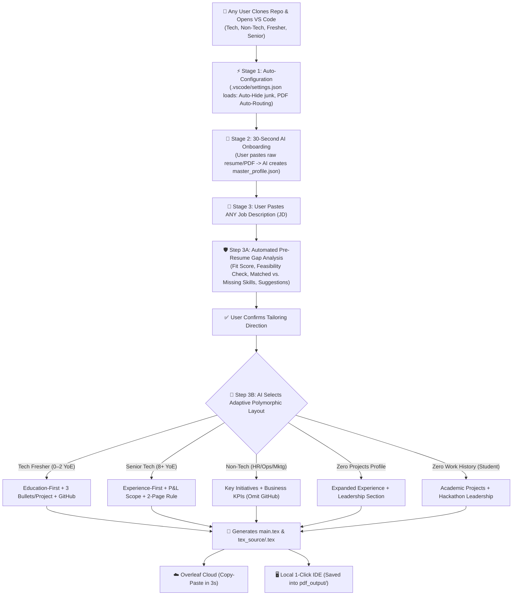

# 🚀 Universal User Workflow Guide (For Any Candidate Background)

This guide documents the exact step-by-step experience for **any candidate from any professional background**—whether you are a **Tech Fresher**, **Senior Software Engineer**, **Non-Tech Corporate Leader (HR, Marketing, Operations, Finance)**, **Career Switcher**, or **Student with zero job experience**—who clones this repository and opens it in **VS Code**, **Cursor**, **Antigravity**, or **Trae**.

---

## 🏗️ System Architecture at a Glance



---

## 📦 What Any New User Sees Upon Cloning

When a new user runs:
```bash
git clone https://github.com/your-username/ats-resume-tailor.git
```
and opens the folder in their editor, they see a clean, production-grade workspace:

```
ats-resume-tailor/
├── .vscode/                      # ⚙️ Pre-configured compiler & auto-hide rules
├── master_profile.template.json  # 📋 Clean template profile schema (Jane Doe)
├── base_template.tex             # 📐 Universal polymorphic 1-page ATS LaTeX skeleton
├── AI_INSTRUCTIONS.md            # 🧠 Universal system directive for any AI model
├── README.md                     # 📖 Quick start documentation
├── WORKFLOW_GUIDE.md             # 🧭 This complete onboarding guide
├── RESUME_RESEARCH_REPORT.md     # 🔬 Deep-dive 10-chapter research compendium
├── tex_source/                   # 📁 Folder for tailored .tex files (for Overleaf users)
└── pdf_output/                   # 📁 Folder for generated .pdf files (for local PDF users)
```

> [!NOTE]
> **Privacy Guaranteed:** A new user will **NEVER** see your personal phone number, email, or past resumes because `.gitignore` keeps private files safely on the original author's computer.

---

## 🔄 The 4-Stage User Journey for Any Background

---

### STAGE 1: Automatic Workspace Setup (0 Seconds, Zero Config)

The instant the user opens the project in their IDE, **the `.vscode/settings.json` file applies automatically**:
* 🛡️ **Zero Clutter:** VS Code automatically hides all compiler junk files (`.aux`, `.log`, `.out`, `.synctex.gz`) from the sidebar.
* 🚀 **PDF Auto-Routing:** The compiler is pre-instructed to output all generated PDFs directly into `pdf_output/`.
* ⚡ **Perl Error Bypassed:** Pre-configured to use standard native `pdflatex`—requiring zero Perl installations.

---

### STAGE 2: 30-Second Profile Onboarding (AI-Automated)

The user only ever has to configure **one file**: their `master_profile.json`.

1. The user opens their AI chat (in Cursor, ChatGPT, Claude, Antigravity, or Copilot) and sends:
   ```text
   Here is my current resume:
   [PASTES RAW RESUME TEXT OR UPLOADS RESUME PDF]

   Read master_profile.template.json and initialize my master_profile.json!
   ```
2. **What the AI does automatically:**
   * Extracts their real name, contact details, education, past jobs, projects, and skills.
   * Dynamically formats optional links (adds GitHub/Portfolio if they have one; omits them cleanly if they don't).
   * Creates multiple role-framing presets per experience entry.
   * Saves their single source of truth into **`master_profile.json`**.
   * **This is a one-time setup.**

---

### STAGE 3: Tailoring for Any Job (The Daily Workflow)

Whenever the user finds a job listing on LinkedIn, Indeed, or a company career site:

1. **User sends to AI:**
   ```text
   Tailor my resume for this job description:
   [PASTES JOB DESCRIPTION]
   ```

2. **Step 3A — Automated Pre-Resume Gap Analysis:**
   Before generating any code, the AI performs an analytical check:
   * **Fit Score:** (e.g. *82% Match — Strong Analytical & Functional Testing Alignment*).
   * **Feasibility Check:** Warns the user if applying outside their field without prerequisites.
   * **Matched Skills:** Hard competencies they already have that match the JD.
   * **Missing Gaps:** Priority JD keywords missing from their profile.
   * **Project Bridge Suggestions:** Recommendations on how to adapt existing projects or what 1 mini-project to build.

3. **Step 3B — Polymorphic LaTeX Generation:**
   Upon user confirmation, the AI dynamically applies the appropriate **Polymorphic Adaptation Matrix** based on the user's background:

---

## 🔀 The Polymorphic Adaptation Matrix (How the System Adapts to 6 Distinct User Personas)

```
┌────────────────────────────────────────────────────────────────────────────────────────────────────────────┐
│                             HOW THE ENGINE ADAPTS TO DIFFERENT BACKGROUNDS                                 │
├─────────────────────────────┬─────────────────────────────┬────────────────────────────────────────────────┤
│ Candidate Background        │ Structural Transformation   │ Bullet & Metric Strategy                       │
├─────────────────────────────┼─────────────────────────────┼────────────────────────────────────────────────┤
│ 1. Tech Fresher             │ • Education near top        │ • 3 detailed bullets per project               │
│    (0–2 YoE / Student)      │ • Includes Class XII/X %    │ • Google XYZ formula (dataset & record scale)  │
│                             │ • \section{Technical Proj}  │ • Anchored with 3 Achievements to fill 1 page  │
├─────────────────────────────┼─────────────────────────────┼────────────────────────────────────────────────┤
│ 2. Senior Tech Engineer     │ • Experience near top       │ • 3–4 bullets per role emphasizing throughput, │
│    (8–15+ YoE)              │ • Omit High School Class X  │   system latency, microservices, and scale     │
│                             │ • Activates 2-Page Layout   │ • Quantifies team mentorship & architecture    │
├─────────────────────────────┼─────────────────────────────┼────────────────────────────────────────────────┤
│ 3. Non-Tech Corporate       │ • Section becomes:          │ • Focuses on business KPIs: $ budget managed,  │
│    (HR, Marketing, Ops)     │   \section{Key Initiatives} │   headcount, retention %, CAC/ROAS, time saved │
│                             │ • Omit GitHub cleanly       │ • Traceable stakeholder ownership              │
├─────────────────────────────┼─────────────────────────────┼────────────────────────────────────────────────┤
│ 4. Finance, Risk & Audit    │ • \section{Technical Proj}  │ • Emphasizes Traceability (RTM), BRDs, audit   │
│    (e.g., Amex GFCC)        │   or \section{Governance}   │   trails, Excel DAX/Power Query, SQL CTEs      │
├─────────────────────────────┼─────────────────────────────┼────────────────────────────────────────────────┤
│ 5. Seasoned Professional    │ • Omit Project Section      │ • Expands Experience to 4–5 bullets per job    │
│    with ZERO Projects       │ • Add: \section{Leadership} │ • Injects strategic program deliverables       │
├─────────────────────────────┼─────────────────────────────┼────────────────────────────────────────────────┤
│ 6. Fresher with ZERO        │ • Experience becomes:       │ • 3–4 detailed technical bullets per project   │
│    Work Experience          │   \section{Academic Proj}   │ • Injects Hackathons & Open-Source Leadership  │
└─────────────────────────────┴─────────────────────────────┴────────────────────────────────────────────────┘
```

---

### STAGE 4: Generating the Final PDF (2 Fast Options)

The user chooses whichever method fits their preference:

#### Option A: Local 1-Click in IDE (VS Code / Cursor / Antigravity)
1. Open `main.tex` (or `tex_source/<role_name>.tex`).
2. Press **`Ctrl + Alt + V`** (Mac: `Cmd + Option + V`).
3. The live PDF preview opens side-by-side, and the clean PDF is automatically saved into **`pdf_output/<role_name>.pdf`**!

#### Option B: Overleaf Cloud (Zero-Install)
1. Open `tex_source/<role_name>.tex` and copy the code.
2. Paste into [Overleaf.com](https://www.overleaf.com) and click **Recompile**.
3. Download your PDF.

---

## ⚙️ What Happens Automatically Behind the Scenes

| Automation Feature | How It Works Automatically |
| :--- | :--- |
| **Dynamic Header Formatting** | Formats active contact links (`Phone`, `Email`, `LinkedIn`, `GitHub`, `Portfolio`) without broken or orphaned `|` delimiters if a link is omitted. |
| **Special Character Escaping** | The AI automatically escapes reserved LaTeX tokens (`C\#`, `AT\&T`, `50\%`, `user\_id`, `\$10k`, `\textasciitilde`). |
| **Dynamic Density Balancing** | Automatically balances bullet depth so that freshers get a **100% full single page** (zero bottom gaps) and senior engineers get a balanced 2-page document (zero 4-line overflow traps). |
| **Canonical ATS Headings** | Guarantees standard dictionary section titles so that Workday, Greenhouse, Lever, and Taleo parsers never misclassify data. |
| **Directory Cleanliness** | `.vscode/settings.json` keeps the workspace clean: `.tex` files stay in `tex_source/` and `.pdf` files stay in `pdf_output/`. |
| **Privacy Protection** | `.gitignore` automatically prevents personal resumes and phone numbers from ever being pushed to public GitHub repositories. |
